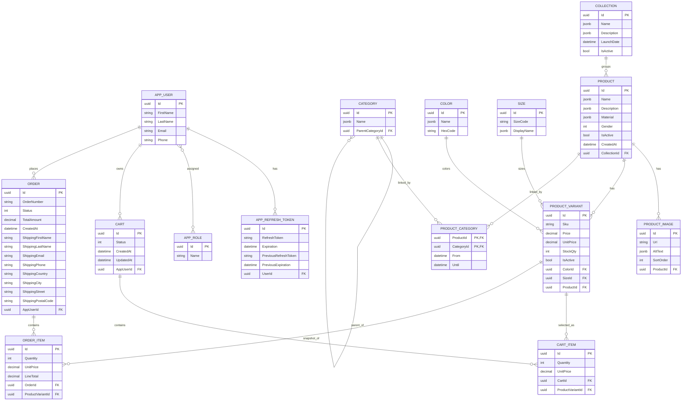

# ERD

This ERD reflects what is implemented in the codebase and initial migration as of April 16, 2026.

## Current schema

## Notes

- `LangStr` fields are stored as `jsonb` for multilingual content.
- `ProductCategory` is the only composite primary key table.
- Category is self-referencing through `ParentCategoryId`.
- Shipping address is currently stored directly on `Order` as flat fields.
- Global delete behavior is configured as `Restrict`.

## Seeded data currently present

- Roles: `Admin`, `Customer`
- Seeded admin user: `admin@shop.ee`
- Seeded catalogue basics:
  - 3 colors
  - 5 sizes
  - 3 categories
  - 1 collection
  - 1 product with image, variants, and category link

## Planned but not implemented in the schema yet

These are mentioned in the docs, but are not part of the current EF model or migration:

- `Review`
- `Address`
- `Wishlist` / `WishlistItem`
