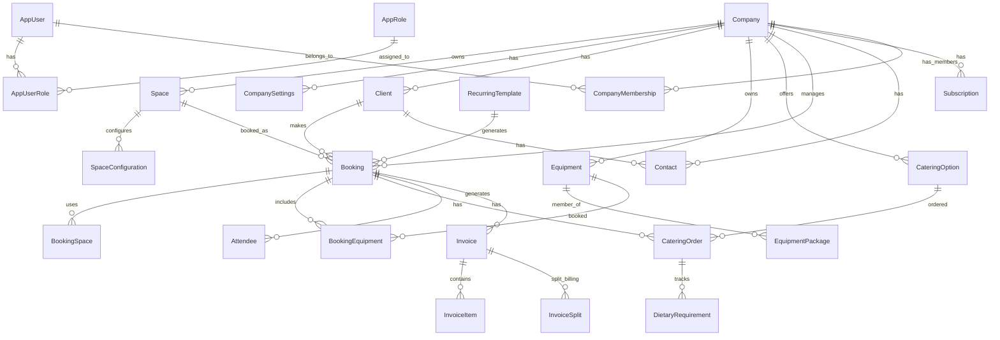

# 30 - Data Model

## Entity Overview



---

## Core Entities

### Company (Tenant Root)

```csharp
public class Company : AuditableEntity, ISoftDelete
{
    public Guid Id { get; set; }
    public string Name { get; set; } = null!;
    public string Slug { get; set; } = null!;  // URL identifier
    public string? LogoUrl { get; set; }
    public string? Address { get; set; }
    public string? Phone { get; set; }
    public string? Email { get; set; }
    public SubscriptionTier Tier { get; set; }
    public DateTime? TrialEndsAt { get; set; }
    public bool IsActive { get; set; }
    
    // Navigation
    public CompanySettings Settings { get; set; } = null!;
    public ICollection<Space> Spaces { get; set; } = [];
    public ICollection<Client> Clients { get; set; } = [];
    public ICollection<Booking> Bookings { get; set; } = [];
}
```

### CompanySettings

```csharp
public class CompanySettings
{
    public Guid CompanyId { get; set; }
    public int DefaultCateringLeadTimeHours { get; set; } = 72;
    public string? DefaultCurrency { get; set; } = "EUR";
    public string? DefaultTimeZone { get; set; } = "Europe/Tallinn";
    public bool RequireBookingApproval { get; set; }
    public int? MaxAdvanceBookingDays { get; set; }
    public int? MinAdvanceBookingHours { get; set; }
    
    public Company Company { get; set; } = null!;
}
```

### Space

```csharp
public class Space : AuditableEntity, ISoftDelete
{
    public Guid Id { get; set; }
    public Guid CompanyId { get; set; }
    public string Name { get; set; } = null!;
    public string? Description { get; set; }
    public int Capacity { get; set; }
    public decimal? DefaultHourlyRate { get; set; }
    public string? Location { get; set; }  // Floor, building section
    public bool IsActive { get; set; } = true;
    
    // Navigation
    public Company Company { get; set; } = null!;
    public ICollection<SpaceConfiguration> Configurations { get; set; } = [];
    public ICollection<BookingSpace> Bookings { get; set; } = [];
}
```

### SpaceConfiguration

```csharp
public class SpaceConfiguration : AuditableEntity
{
    public Guid Id { get; set; }
    public Guid SpaceId { get; set; }
    public Guid? CombinedWithSpaceId { get; set; }  // For combined rooms
    public string ConfigurationName { get; set; } = null!;  // e.g., "Theater", "Classroom"
    public int? AdjustedCapacity { get; set; }
    public decimal? AdjustedHourlyRate { get; set; }
    public bool IsDefault { get; set; }
    
    public Space Space { get; set; } = null!;
    public Space? CombinedWithSpace { get; set; }
}
```

### Client

```csharp
public class Client : AuditableEntity, ISoftDelete
{
    public Guid Id { get; set; }
    public Guid CompanyId { get; set; }
    public string Name { get; set; } = null!;
    public string? OrganizationNumber { get; set; }
    public string? Email { get; set; }
    public string? Phone { get; set; }
    public string? Address { get; set; }
    public string? Notes { get; set; }
    public bool IsActive { get; set; } = true;
    
    public Company Company { get; set; } = null!;
    public ICollection<Booking> Bookings { get; set; } = [];
    public ICollection<Contact> Contacts { get; set; } = [];
}
```

### Contact

```csharp
public class Contact : AuditableEntity, ISoftDelete
{
    public Guid Id { get; set; }
    public Guid CompanyId { get; set; }
    public Guid? ClientId { get; set; }
    public string FirstName { get; set; } = null!;
    public string LastName { get; set; } = null!;
    public string? Email { get; set; }
    public string? Phone { get; set; }
    public string? Role { get; set; }  // e.g., "Event Coordinator"
    public bool IsPrimary { get; set; }
    public string? Notes { get; set; }
    
    public Company Company { get; set; } = null!;
    public Client? Client { get; set; }
}
```

---

## Booking Domain

### Booking (Aggregate Root)

```csharp
public class Booking : AuditableEntity, ISoftDelete
{
    public Guid Id { get; set; }
    public Guid CompanyId { get; set; }
    public Guid ClientId { get; set; }
    public Guid? RecurringTemplateId { get; set; }
    public string Title { get; set; } = null!;
    public string? Description { get; set; }
    public DateTime StartTime { get; set; }
    public DateTime EndTime { get; set; }
    public int AttendeeCount { get; set; }
    public BookingStatus Status { get; set; }
    public decimal? TotalAmount { get; set; }
    public string? Notes { get; set; }
    
    // Navigation
    public Company Company { get; set; } = null!;
    public Client Client { get; set; } = null!;
    public RecurringTemplate? RecurringTemplate { get; set; }
    public ICollection<BookingSpace> Spaces { get; set; } = [];
    public ICollection<BookingEquipment> Equipment { get; set; } = [];
    public ICollection<CateringOrder> CateringOrders { get; set; } = [];
    public ICollection<Attendee> Attendees { get; set; } = [];
    public ICollection<Invoice> Invoices { get; set; } = [];
}

public enum BookingStatus
{
    Pending,
    Confirmed,
    InProgress,
    Completed,
    Cancelled
}
```

### BookingSpace (Join Entity)

```csharp
public class BookingSpace
{
    public Guid BookingId { get; set; }
    public Guid SpaceId { get; set; }
    public Guid? SpaceConfigurationId { get; set; }
    public decimal? HourlyRate { get; set; }
    public string? Notes { get; set; }
    
    public Booking Booking { get; set; } = null!;
    public Space Space { get; set; } = null!;
    public SpaceConfiguration? Configuration { get; set; }
}
```

### RecurringTemplate

One template generates multiple bookings. Use join entities for collection properties to maintain EF compatibility.

```csharp
public class RecurringTemplate : AuditableEntity
{
    public Guid Id { get; set; }
    public Guid CompanyId { get; set; }
    public string Name { get; set; } = null!;
    public RecurrencePattern Pattern { get; set; }
    public int Interval { get; set; }  // Every N days/weeks/months
    public DateTime? EndDate { get; set; }
    public int? OccurrenceCount { get; set; }
    
    // Template data
    public string DefaultTitle { get; set; } = null!;
    public TimeSpan DefaultDuration { get; set; }
    public Guid DefaultClientId { get; set; }
    
    // Navigation - one template generates many bookings
    public Company Company { get; set; } = null!;
    public ICollection<Booking> GeneratedBookings { get; set; } = [];
    public ICollection<RecurringTemplateDayOfWeek> DaysOfWeek { get; set; } = [];
    public ICollection<RecurringTemplateSpace> DefaultSpaces { get; set; } = [];
}

public enum RecurrencePattern
{
    Daily,
    Weekly,
    Monthly
}

// Join entity for DaysOfWeek collection
public class RecurringTemplateDayOfWeek
{
    public Guid TemplateId { get; set; }
    public DayOfWeek DayOfWeek { get; set; }
    
    public RecurringTemplate Template { get; set; } = null!;
}

// Join entity for DefaultSpaces collection
public class RecurringTemplateSpace
{
    public Guid TemplateId { get; set; }
    public Guid SpaceId { get; set; }
    
    public RecurringTemplate Template { get; set; } = null!;
}
```

---

## Equipment Domain

### Equipment

```csharp
public class Equipment : AuditableEntity, ISoftDelete
{
    public Guid Id { get; set; }
    public Guid CompanyId { get; set; }
    public string Name { get; set; } = null!;
    public string? Description { get; set; }
    public string? SerialNumber { get; set; }
    public int TotalQuantity { get; set; } = 1;
    public decimal? DefaultDailyRate { get; set; }
    public string? StorageLocation { get; set; }
    public bool IsActive { get; set; } = true;
    
    public Company Company { get; set; } = null!;
    public ICollection<EquipmentPackage> Packages { get; set; } = [];
    public ICollection<BookingEquipment> Bookings { get; set; } = [];
}
```

### EquipmentPackage

```csharp
public class EquipmentPackage : AuditableEntity, ISoftDelete
{
    public Guid Id { get; set; }
    public Guid CompanyId { get; set; }
    public string Name { get; set; } = null!;
    public string? Description { get; set; }
    public decimal? PackageDiscountPercent { get; set; }
    public bool IsActive { get; set; } = true;
    
    public Company Company { get; set; } = null!;
    public ICollection<EquipmentPackageItem> Items { get; set; } = [];
}

public class EquipmentPackageItem
{
    public Guid EquipmentPackageId { get; set; }
    public Guid EquipmentId { get; set; }
    public int Quantity { get; set; }
    
    public EquipmentPackage Package { get; set; } = null!;
    public Equipment Equipment { get; set; } = null!;
}
```

### BookingEquipment

```csharp
public class BookingEquipment
{
    public Guid BookingId { get; set; }
    public Guid EquipmentId { get; set; }
    public int Quantity { get; set; }
    public decimal? DailyRate { get; set; }
    public string? Notes { get; set; }
    
    public Booking Booking { get; set; } = null!;
    public Equipment Equipment { get; set; } = null!;
}
```

---

## Catering Domain

### CateringOption

```csharp
public class CateringOption : AuditableEntity, ISoftDelete
{
    public Guid Id { get; set; }
    public Guid CompanyId { get; set; }
    public string Name { get; set; } = null!;
    public string? Description { get; set; }
    public string Category { get; set; } = null!;  // Breakfast, Lunch, Coffee, etc.
    public decimal PricePerPerson { get; set; }
    public int MinOrderQuantity { get; set; } = 1;
    public int LeadTimeHours { get; set; } = 72;
    public bool IsActive { get; set; } = true;
    
    public Company Company { get; set; } = null!;
}
```

### CateringOrder

```csharp
public class CateringOrder : AuditableEntity
{
    public Guid Id { get; set; }
    public Guid BookingId { get; set; }
    public Guid CateringOptionId { get; set; }
    public int Quantity { get; set; }
    public DateTime ServiceTime { get; set; }
    public string? SpecialRequests { get; set; }
    public CateringOrderStatus Status { get; set; }
    public DateTime LockedAtUtc { get; set; }  // When lead time locked
    
    public Booking Booking { get; set; } = null!;
    public CateringOption Option { get; set; } = null!;
    public ICollection<CateringDietaryRequirement> DietaryRequirements { get; set; } = [];
}

// Rule: Locked state is evaluated in application layer using current UTC time:
// bool isLocked = DateTime.UtcNow >= cateringOrder.LockedAtUtc;

public enum CateringOrderStatus
{
    Pending,
    Confirmed,
    InPreparation,
    Delivered,
    Cancelled
}
```

### Attendee

```csharp
public class Attendee
{
    public Guid Id { get; set; }
    public Guid BookingId { get; set; }
    public string FirstName { get; set; } = null!;
    public string LastName { get; set; } = null!;
    public string? Email { get; set; }
    public string? DietaryNotes { get; set; }
    public bool IsPrimaryContact { get; set; }
    
    public Booking Booking { get; set; } = null!;
}
```

---

## Billing Domain

### Invoice

```csharp
public class Invoice : AuditableEntity, ISoftDelete
{
    public Guid Id { get; set; }
    public Guid CompanyId { get; set; }
    public Guid BookingId { get; set; }
    public string InvoiceNumber { get; set; } = null!;
    public DateTime IssueDate { get; set; }
    public DateTime DueDate { get; set; }
    public decimal TotalAmount { get; set; }
    public decimal TotalPaid { get; set; }
    public InvoiceStatus Status { get; set; }
    public string? Notes { get; set; }
    public string? PurchaseOrderNumber { get; set; }
    
    public Company Company { get; set; } = null!;
    public Booking Booking { get; set; } = null!;
    public ICollection<InvoiceItem> Items { get; set; } = [];
    public ICollection<InvoiceSplit> Splits { get; set; } = [];
}

public enum InvoiceStatus
{
    Draft,
    Sent,
    Paid,
    Overdue,
    Cancelled
}
```

### InvoiceItem

```csharp
public class InvoiceItem
{
    public Guid Id { get; set; }
    public Guid InvoiceId { get; set; }
    public InvoiceItemType Type { get; set; }
    public string Description { get; set; } = null!;
    public decimal Quantity { get; set; }
    public decimal UnitPrice { get; set; }
    public decimal DiscountPercent { get; set; }
    public decimal LineTotal => Quantity * UnitPrice * (1 - DiscountPercent / 100);
    public string? Notes { get; set; }
    
    public Invoice Invoice { get; set; } = null!;
}

public enum InvoiceItemType
{
    SpaceRental,
    EquipmentRental,
    Catering,
    ServiceFee,
    Discount,
    Tax
}
```

### InvoiceSplit

```csharp
public class InvoiceSplit
{
    public Guid Id { get; set; }
    public Guid InvoiceId { get; set; }
    public Guid? ContactId { get; set; }  // Who pays this portion
    public string Description { get; set; } = null!;  // e.g., "Catering only"
    public decimal Amount { get; set; }
    public decimal Percentage { get; set; }
    public bool IsPaid { get; set; }
    
    public Invoice Invoice { get; set; } = null!;
    public Contact? Contact { get; set; }
}
```

---

## Identity Domain

### AppUser

```csharp
public class AppUser : IdentityUser<Guid>
{
    public string FirstName { get; set; } = null!;
    public string LastName { get; set; } = null!;
    public DateTime CreatedAt { get; set; }
    public bool IsSystemAdmin { get; set; }
    
    public ICollection<CompanyMembership> CompanyMemberships { get; set; } = [];
}
```

### AppRole

```csharp
public class AppRole : IdentityRole<Guid>
{
    public string? Description { get; set; }
    public bool IsSystemRole { get; set; }
    public ICollection<AppUserRole> UserRoles { get; set; } = [];
}
```

### CompanyMembership

```csharp
public class CompanyMembership
{
    public Guid UserId { get; set; }
    public Guid CompanyId { get; set; }
    public TenantRole Role { get; set; }
    public DateTime JoinedAt { get; set; }
    public bool IsActive { get; set; } = true;
    
    public AppUser User { get; set; } = null!;
    public Company Company { get; set; } = null!;
}

public enum TenantRole
{
    CompanyOwner,      // Full access, can delete company
    CompanyAdmin,      // Can manage users and settings
    CompanyManager,    // Can manage bookings and clients
    CompanyEmployee    // Can view and create bookings
}
```

---

## Subscription Domain

### Subscription

```csharp
public class Subscription : AuditableEntity
{
    public Guid Id { get; set; }
    public Guid CompanyId { get; set; }
    public SubscriptionTier Tier { get; set; }
    public DateTime StartDate { get; set; }
    public DateTime? EndDate { get; set; }
    public decimal MonthlyPrice { get; set; }
    public SubscriptionStatus Status { get; set; }
    public string? PaymentProviderId { get; set; }
    
    public Company Company { get; set; } = null!;
}

public enum SubscriptionTier
{
    Free,
    Standard,
    Premium
}

public enum SubscriptionStatus
{
    Trial,
    Active,
    PastDue,
    Cancelled,
    Expired
}
```

---

## Base Interfaces

```csharp
// BaseDomain/Interfaces.cs

public interface IAuditableEntity
{
    DateTime CreatedAt { get; set; }
    string? CreatedBy { get; set; }
    DateTime? UpdatedAt { get; set; }
    string? UpdatedBy { get; set; }
}

public interface ISoftDelete
{
    bool IsDeleted { get; set; }
    DateTime? DeletedAt { get; set; }
    string? DeletedBy { get; set; }
}

public interface ITenantScoped
{
    Guid CompanyId { get; set; }
}

public abstract class AuditableEntity : IAuditableEntity
{
    public DateTime CreatedAt { get; set; }
    public string? CreatedBy { get; set; }
    public DateTime? UpdatedAt { get; set; }
    public string? UpdatedBy { get; set; }
}

public abstract class BaseEntity : AuditableEntity, ISoftDelete, ITenantScoped
{
    public Guid Id { get; set; }
    public Guid CompanyId { get; set; }
    public bool IsDeleted { get; set; }
    public DateTime? DeletedAt { get; set; }
    public string? DeletedBy { get; set; }
}
```
