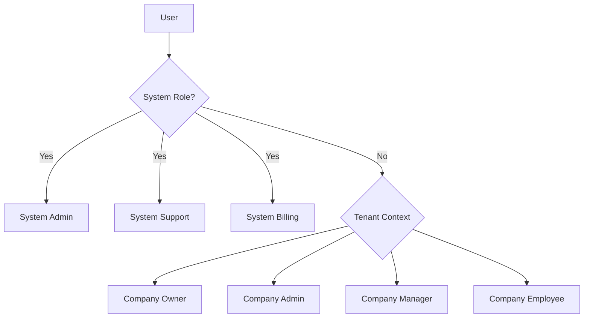

# 40 - Security and Roles

## Authentication

### Identity Configuration

```csharp
// Using ASP.NET Core Identity with custom entities
services.AddIdentity<AppUser, AppRole>(options =>
{
    options.Password.RequireDigit = true;
    options.Password.RequiredLength = 8;
    options.Password.RequireNonAlphanumeric = false;
    options.User.RequireUniqueEmail = true;
    options.SignIn.RequireConfirmedEmail = true;
})
.AddEntityFrameworkStores<ApplicationDbContext>()
.AddDefaultTokenProviders();
```

### User Model

```csharp
public class AppUser : IdentityUser<Guid>
{
    public string FirstName { get; set; } = null!;
    public string LastName { get; set; } = null!;
    public DateTime CreatedAt { get; set; } = DateTime.UtcNow;
    
    // System-level admin (cross-tenant)
    public bool IsSystemAdmin { get; set; }
    
    // Navigation
    public ICollection<CompanyMembership> CompanyMemberships { get; set; } = [];
}
```

---

## Authorization Model

### Two-Level Role System



### System Roles (Cross-Tenant)

| Role | Permissions |
|------|-------------|
| **SystemAdmin** | Full system access, manage all tenants, impersonation |
| **SystemSupport** | View all tenant data, support actions, read-only billing |
| **SystemBilling** | Manage subscriptions, invoicing, payment issues |

System roles are assigned via `AppUser.IsSystemAdmin` flag and `AppRole.IsSystemRole = true`.

### Tenant Roles (Per-Company)

| Role | Bookings | Clients | Spaces | Users | Settings | Billing |
|------|----------|---------|--------|-------|----------|---------|
| **CompanyOwner** | CRUD | CRUD | CRUD | CRUD | CRUD | Full |
| **CompanyAdmin** | CRUD | CRUD | CRUD | CRUD | CRUD | View |
| **CompanyManager** | CRUD | CRUD | View | - | View | - |
| **CompanyEmployee** | Create/View | View | View | - | - | - |

CRUD = Create, Read, Update, Delete

### Role Implementation

```csharp
public enum TenantRole
{
    CompanyOwner,
    CompanyAdmin,
    CompanyManager,
    CompanyEmployee
}

public class CompanyMembership
{
    public Guid UserId { get; set; }
    public Guid CompanyId { get; set; }
    public TenantRole Role { get; set; }
    public DateTime JoinedAt { get; set; }
    public bool IsActive { get; set; } = true;
}
```

---

## Tenant Isolation

### Company Slug Resolution

```csharp
// Middleware extracts company from route
// Route pattern: /{companySlug}/bookings

public class TenantResolutionMiddleware
{
    public async Task InvokeAsync(HttpContext context, ITenantContext tenantContext)
    {
        var companySlug = context.Request.RouteValues["companySlug"]?.ToString();
        if (!string.IsNullOrEmpty(companySlug))
        {
            var company = await dbContext.Companies
                .FirstOrDefaultAsync(c => c.Slug == companySlug);
                
            if (company != null)
            {
                tenantContext.SetCompany(company.Id, company.Slug);
            }
        }
        await _next(context);
    }
}
```

### Global Query Filter

Explicit filter application - no reflection. Define `ITenantScoped` interface and apply filters directly in DbContext.

```csharp
public interface ITenantScoped
{
    Guid CompanyId { get; }
}

public class ApplicationDbContext : IdentityDbContext<AppUser, AppRole, Guid>
{
    private readonly ITenantContext _tenantContext;
    
    protected override void OnModelCreating(ModelBuilder builder)
    {
        base.OnModelCreating(builder);
        
        // Apply explicit tenant filters per entity
        builder.Entity<Company>().HasQueryFilter(e => e.Id == _tenantContext.CurrentCompanyId);
        builder.Entity<Space>().HasQueryFilter(e => e.CompanyId == _tenantContext.CurrentCompanyId);
        builder.Entity<Client>().HasQueryFilter(e => e.CompanyId == _tenantContext.CurrentCompanyId);
        builder.Entity<Booking>().HasQueryFilter(e => e.CompanyId == _tenantContext.CurrentCompanyId);
        builder.Entity<Equipment>().HasQueryFilter(e => e.CompanyId == _tenantContext.CurrentCompanyId);
        builder.Entity<CateringOption>().HasQueryFilter(e => e.CompanyId == _tenantContext.CurrentCompanyId);
        builder.Entity<Invoice>().HasQueryFilter(e => e.CompanyId == _tenantContext.CurrentCompanyId);
        
        // Apply soft delete filters explicitly
        builder.Entity<Company>().HasQueryFilter(e => !e.IsDeleted);
        builder.Entity<Space>().HasQueryFilter(e => !e.IsDeleted);
        builder.Entity<Client>().HasQueryFilter(e => !e.IsDeleted);
        builder.Entity<Booking>().HasQueryFilter(e => !e.IsDeleted);
        builder.Entity<Equipment>().HasQueryFilter(e => !e.IsDeleted);
        builder.Entity<CateringOption>().HasQueryFilter(e => !e.IsDeleted);
        builder.Entity<Invoice>().HasQueryFilter(e => !e.IsDeleted);
    }
}
```

**Note:** v1 uses explicit filter application. Reflection-based auto-wiring is reserved for future enhancement if entity count grows significantly.

### Tenant Context Service

```csharp
public interface ITenantContext
{
    Guid? CurrentCompanyId { get; }
    string? CurrentCompanySlug { get; }
    bool HasTenant => CurrentCompanyId.HasValue;
    void SetCompany(Guid companyId, string slug);
}

public class TenantContext : ITenantContext
{
    public Guid? CurrentCompanyId { get; private set; }
    public string? CurrentCompanySlug { get; private set; }
    
    public void SetCompany(Guid companyId, string slug)
    {
        CurrentCompanyId = companyId;
        CurrentCompanySlug = slug;
    }
}
```

---

## V1 Authorization Strategy

**Role-based authorization only for MVP.**

V1 uses a simplified role-based approach:
- Check `TenantRole` on `CompanyMembership` for tenant access
- Check `AppUser.IsSystemAdmin` for system-level access
- No granular permission checks in V1

This keeps the initial implementation simple while maintaining security boundaries.

---

## Permission System [Phase 5+]

> **Note:** The following permission system is designed for future enhancement (Phase 5+).
> It is NOT required for V1 MVP. V1 relies on role-based authorization only.

### Permission-Based Authorization

```csharp
public enum Permission
{
    // Booking permissions
    BookingsView,
    BookingsCreate,
    BookingsEdit,
    BookingsDelete,
    BookingsApprove,
    
    // Client permissions
    ClientsView,
    ClientsCreate,
    ClientsEdit,
    ClientsDelete,
    
    // Space permissions
    SpacesView,
    SpacesCreate,
    SpacesEdit,
    SpacesDelete,
    
    // Equipment permissions
    EquipmentView,
    EquipmentCreate,
    EquipmentEdit,
    EquipmentDelete,
    
    // User management
    UsersView,
    UsersCreate,
    UsersEdit,
    UsersDelete,
    
    // Settings
    SettingsView,
    SettingsEdit,
    
    // Billing
    InvoicesView,
    InvoicesCreate,
    InvoicesEdit,
    InvoicesDelete,
    
    // Company
    CompanyDelete
}
```

### Permission Mapping

```csharp
public static class RolePermissions
{
    public static IReadOnlySet<Permission> GetPermissions(TenantRole role) => role switch
    {
        TenantRole.CompanyOwner => AllPermissions,
        TenantRole.CompanyAdmin => AdminPermissions,
        TenantRole.CompanyManager => ManagerPermissions,
        TenantRole.CompanyEmployee => EmployeePermissions,
        _ => new HashSet<Permission>()
    };
    
    private static readonly IReadOnlySet<Permission> AllPermissions = 
        Enum.GetValues<Permission>().ToHashSet();
        
    private static readonly IReadOnlySet<Permission> AdminPermissions = new HashSet<Permission>
    {
        // All except CompanyDelete
        Permission.BookingsView, Permission.BookingsCreate, 
        Permission.BookingsEdit, Permission.BookingsDelete, Permission.BookingsApprove,
        Permission.ClientsView, Permission.ClientsCreate, Permission.ClientsEdit, Permission.ClientsDelete,
        Permission.SpacesView, Permission.SpacesCreate, Permission.SpacesEdit, Permission.SpacesDelete,
        Permission.EquipmentView, Permission.EquipmentCreate, Permission.EquipmentEdit, Permission.EquipmentDelete,
        Permission.UsersView, Permission.UsersCreate, Permission.UsersEdit, Permission.UsersDelete,
        Permission.SettingsView, Permission.SettingsEdit,
        Permission.InvoicesView, Permission.InvoicesCreate, Permission.InvoicesEdit, Permission.InvoicesDelete
    };
    
    private static readonly IReadOnlySet<Permission> ManagerPermissions = new HashSet<Permission>
    {
        Permission.BookingsView, Permission.BookingsCreate, Permission.BookingsEdit, Permission.BookingsApprove,
        Permission.ClientsView, Permission.ClientsCreate, Permission.ClientsEdit,
        Permission.SpacesView,
        Permission.EquipmentView,
        Permission.SettingsView
    };
    
    private static readonly IReadOnlySet<Permission> EmployeePermissions = new HashSet<Permission>
    {
        Permission.BookingsView, Permission.BookingsCreate,
        Permission.ClientsView,
        Permission.SpacesView,
        Permission.EquipmentView
    };
}
```

### Authorization Handler

```csharp
public class PermissionAuthorizationHandler : 
    AuthorizationHandler<PermissionRequirement>
{
    protected override async Task HandleRequirementAsync(
        AuthorizationHandlerContext context,
        PermissionRequirement requirement)
    {
        var userId = context.User.GetUserId();
        var companyId = _tenantContext.CurrentCompanyId;
        
        // System admins bypass all permission checks
        if (context.User.IsInRole("SystemAdmin"))
        {
            context.Succeed(requirement);
            return;
        }
        
        if (!companyId.HasValue)
        {
            return;
        }
        
        // Get user's role in current company
        var membership = await _dbContext.CompanyMemberships
            .FirstOrDefaultAsync(m => m.UserId == userId && m.CompanyId == companyId);
            
        if (membership == null || !membership.IsActive)
        {
            return;
        }
        
        var permissions = RolePermissions.GetPermissions(membership.Role);
        
        if (permissions.Contains(requirement.Permission))
        {
            context.Succeed(requirement);
        }
    }
}

public class PermissionRequirement : IAuthorizationRequirement
{
    public Permission Permission { get; }
    public PermissionRequirement(Permission permission) => Permission = permission;
}
```

### Usage in Controllers

```csharp
[Authorize]
[Route("{companySlug}/[controller]")]
public class BookingsController : Controller
{
    [RequirePermission(Permission.BookingsView)]
    public async Task<IActionResult> Index() { }
    
    [RequirePermission(Permission.BookingsCreate)]
    public async Task<IActionResult> Create() { }
    
    [RequirePermission(Permission.BookingsDelete)]
    public async Task<IActionResult> Delete(Guid id) { }
}

// Custom attribute
public class RequirePermissionAttribute : AuthorizeAttribute
{
    public RequirePermissionAttribute(Permission permission)
    {
        Policy = permission.ToString();
    }
}
```

---

## Audit Trail

### Audit Entity

```csharp
public class AuditLog
{
    public Guid Id { get; set; }
    public Guid? CompanyId { get; set; }
    public string TableName { get; set; } = null!;
    public string RecordId { get; set; } = null!;
    public AuditAction Action { get; set; }
    public string? OldValues { get; set; }
    public string? NewValues { get; set; }
    public DateTime Timestamp { get; set; }
    public string? UserId { get; set; }
    public string? UserEmail { get; set; }
}

public enum AuditAction
{
    Create,
    Update,
    Delete
}
```

### Audit Behavior

```csharp
public class AuditBehavior<TRequest, TResponse> : IPipelineBehavior<TRequest, TResponse>
    where TRequest : IRequest<TResponse>
{
    public async Task<TResponse> Handle(
        TRequest request,
        RequestHandlerDelegate<TResponse> next,
        CancellationToken cancellationToken)
    {
        var response = await next();
        
        // Audit logic here for commands
        if (request is IAuditableCommand auditable)
        {
            await _auditService.LogAsync(auditable);
        }
        
        return response;
    }
}
```

---

## Security Checklist

- [ ] All endpoints require authentication (except public pages)
- [ ] Tenant context validated on every request
- [ ] Query filters applied to all tenant-scoped entities
- [ ] Soft delete filter prevents access to deleted records
- [ ] Permission checks on all mutating operations
- [ ] Audit logging for all data changes
- [ ] XSS protection via Razor encoding
- [ ] CSRF tokens on all forms
- [ ] HTTPS enforcement in production
- [ ] Secure cookie settings
- [ ] Password complexity requirements enforced
- [ ] Account lockout after failed attempts
- [ ] Email confirmation required
