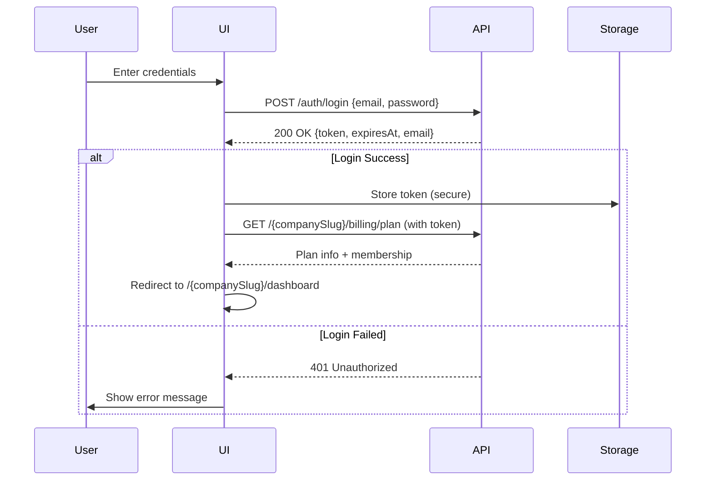

# UI Implementation Plan

**VenuePlatform SaaS - Multi-Tenant Frontend Architecture**

**Created:** 2026-03-04T17:12:19Z  
**Phase:** UI Implementation Plan

---

## Table of Contents

1. [UI Roadmap (Phased Rollout)](#1-ui-roadmap-phased-rollout)
2. [Routing Model](#2-routing-model)
3. [Authentication Flow](#3-authentication-flow)
4. [API Client Strategy](#4-api-client-strategy)
5. [Role-Based UI Gating](#5-role-based-ui-gating)
6. [Plan-Based UI Gating](#6-plan-based-ui-gating)
7. [Core Screens](#7-core-screens)
8. [Validation UX](#8-validation-ux)
9. [State Management](#9-state-management)
10. [Testing & Verification](#10-testing--verification)
11. [Non-Functional UI Considerations](#11-non-functional-ui-considerations)
12. [Implementation Timeline](#12-implementation-timeline)

---

## 1. UI Roadmap (Phased Rollout)

### UI Phase 1: Foundation
**Goal:** Authentication, tenant routing, and core navigation structure

**Screens:**
- Login page (`/login`)
- Tenant selection/entry page
- Basic dashboard shell with navigation
- 404 Not Found page

**APIs Used:**
- `POST /auth/login` - User authentication
- `GET /health` - Health check (no tenant)
- `GET /{companySlug}/health` - Tenant health check
- `GET /{companySlug}/billing/plan` - Load plan information

**Verification Criteria:**
- [ ] User can log in and receive JWT token
- [ ] Tenant slug is extracted from URL
- [ ] Unauthorized users are redirected to login
- [ ] Invalid tenant slugs show 404

---

### UI Phase 2: Client & Space Management
**Goal:** CRUD operations for clients and spaces

**Screens:**
- Client list (`/{companySlug}/clients`)
- Create client form
- Edit client form
- Space list (`/{companySlug}/spaces`)
- Create space form
- Space detail view
- Space availability search

**APIs Used:**
- `GET /{companySlug}/clients` - List clients
- `POST /{companySlug}/clients/seed-one` (DEV) - Create test client
- `GET /{companySlug}/spaces` - List spaces
- `GET /{companySlug}/spaces/{id}` - Get space details
- `POST /{companySlug}/spaces` - Create space
- `POST /{companySlug}/spaces/{id}/deactivate` - Deactivate space
- `GET /{companySlug}/spaces/availability` - Search available spaces

**Verification Criteria:**
- [ ] Clients can be created and listed
- [ ] Spaces can be created, viewed, and deactivated
- [ ] Space availability search returns results
- [ ] Role-based access works (Employees can view, Managers can edit)

---

### UI Phase 3: Space Configurations
**Goal:** Manage combinable space configurations

**Screens:**
- Space configuration list (`/{companySlug}/space-configurations`)
- Create configuration form
- Configuration detail view
- Assign spaces to configuration

**APIs Used:**
- `GET /{companySlug}/space-configurations` - List configurations
- `POST /{companySlug}/space-configurations` - Create configuration
- `GET /{companySlug}/space-configurations/{id}` - Get configuration with spaces
- `PUT /{companySlug}/space-configurations/{id}/spaces` - Assign spaces

**Verification Criteria:**
- [ ] Configurations can be created with name and optional overrides
- [ ] Spaces can be assigned to configurations
- [ ] Configuration detail shows associated spaces
- [ ] Tenant isolation prevents cross-tenant access

---

### UI Phase 4: Booking Management
**Goal:** Complete booking lifecycle with conflict detection

**Screens:**
- Booking list (`/{companySlug}/bookings`)
- Create booking form (with space selection)
- Booking detail view
- Edit booking form
- Cancel booking confirmation
- Space availability calendar view

**APIs Used:**
- `GET /{companySlug}/bookings` - List bookings
- `GET /{companySlug}/bookings/{id}` - Get booking
- `GET /{companySlug}/bookings/{id}/details` - Get detailed booking info
- `POST /{companySlug}/bookings` - Create booking (without spaces)
- `POST /{companySlug}/bookings/with-spaces` - Create booking with spaces
- `PUT /{companySlug}/bookings/{id}` - Update booking
- `PUT /{companySlug}/bookings/{id}/spaces` - Update booking spaces
- `PUT /{companySlug}/bookings/{id}/with-spaces` - Update booking and spaces atomically
- `POST /{companySlug}/bookings/{id}/confirm` - Confirm booking
- `DELETE /{companySlug}/bookings/{id}` - Cancel booking
- `GET /{companySlug}/spaces/availability` - Check space availability

**Verification Criteria:**
- [ ] Bookings can be created with client and spaces
- [ ] Conflict detection prevents double-booking spaces
- [ ] Booking status transitions (Pending → Confirmed → Cancelled)
- [ ] Total amount is calculated correctly (15-min ceiling billing)
- [ ] Cancelled bookings cannot be modified

---

### UI Phase 5: Invoicing & Payments
**Goal:** Invoice generation, management, and payment recording

**Screens:**
- Invoice list (`/{companySlug}/invoices`)
- Invoice detail view
- Create invoice from booking
- Invoice lifecycle actions (Issue, Void, Mark Sent, Mark Paid)
- Payment recording form
- Payment list for invoice
- PDF download
- Email sending

**APIs Used:**
- `GET /{companySlug}/invoices` - List invoices
- `GET /{companySlug}/invoices/{id}` - Get invoice with items
- `POST /{companySlug}/bookings/{id}/invoice` - Create invoice from booking
- `POST /{companySlug}/invoices/{id}/issue` - Issue invoice
- `POST /{companySlug}/invoices/{id}/void` - Void invoice
- `POST /{companySlug}/invoices/{id}/mark-sent` - Mark as sent
- `POST /{companySlug}/invoices/{id}/mark-paid` - Mark as paid
- `GET /{companySlug}/invoices/{id}/pdf` - Download PDF
- `POST /{companySlug}/invoices/{id}/generate-download-link` - Generate secure download link
- `POST /{companySlug}/invoices/{id}/send-email` - Send invoice email
- `POST /{companySlug}/invoices/{id}/payments` - Record payment
- `GET /{companySlug}/invoices/{id}/payments` - List payments

**Verification Criteria:**
- [ ] Invoices can be created from confirmed bookings only
- [ ] Invoice lifecycle: Draft → Issued → (Sent) → Paid/Void
- [ ] Payment recording validates against invoice total
- [ ] Overpayment is prevented (unless explicitly allowed)
- [ ] PDF download works via token-based or authenticated access
- [ ] Email sending respects 10-minute cooldown (configurable with force)

---

### UI Phase 6: Reporting & Dashboard
**Goal:** Business intelligence and plan management

**Screens:**
- Dashboard (`/{companySlug}/dashboard`)
  - Plan usage widget
  - Revenue summary widget
  - Occupancy summary widget
- Revenue report (`/{companySlug}/reports/revenue`)
- Daily revenue chart
- Occupancy report (`/{companySlug}/reports/occupancy`)
- Daily occupancy chart
- Plan management page (`/{companySlug}/billing/plan`)

**APIs Used:**
- `GET /{companySlug}/billing/plan` - Get plan usage and limits
- `GET /{companySlug}/reports/revenue` - Revenue summary
- `GET /{companySlug}/reports/revenue/daily` - Daily revenue (with optional zero-fill)
- `GET /{companySlug}/reports/occupancy` - Occupancy summary
- `GET /{companySlug}/reports/occupancy/daily` - Daily occupancy (with optional zero-fill)

**Verification Criteria:**
- [ ] Dashboard loads with plan usage displayed
- [ ] Revenue reports show correct totals
- [ ] Occupancy reports show space utilization
- [ ] Zero-fill toggle is hidden for Free plan users
- [ ] Pro-only features show upgrade prompts for Free users

---

## 2. Routing Model

### URL Structure

```
# Public routes (no tenant)
/login                    # Login page
/health                   # Platform health (no auth)

# Tenant-scoped routes (/{companySlug})
/{companySlug}/dashboard              # Main dashboard
/{companySlug}/clients                # Client management
/{companySlug}/clients/new            # Create client
/{companySlug}/clients/{id}           # Client detail/edit
/{companySlug}/spaces                 # Space management
/{companySlug}/spaces/new             # Create space
/{companySlug}/spaces/{id}            # Space detail
/{companySlug}/space-configurations   # Space configurations
/{companySlug}/space-configurations/new
/{companySlug}/space-configurations/{id}
/{companySlug}/bookings               # Booking list
/{companySlug}/bookings/new           # Create booking
/{companySlug}/bookings/{id}          # Booking detail
/{companySlug}/invoices               # Invoice list
/{companySlug}/invoices/{id}          # Invoice detail
/{companySlug}/reports                # Reports landing
/{companySlug}/reports/revenue        # Revenue reports
/{companySlug}/reports/occupancy      # Occupancy reports
/{companySlug}/billing/plan           # Plan & usage
```

### Tenant Resolution Strategy

1. **Extract companySlug from URL path**
   - First path segment after domain: `/{companySlug}/...`
   - Validate format: 2-64 chars, lowercase, alphanumeric + hyphens only

2. **Resolve tenant on app initialization**
   - When user navigates to tenant-scoped route, validate company exists
   - Load company info (name, slug, plan) into app context
   - If invalid/missing slug → show 404 page

3. **Tenant context in state**
   ```typescript
   interface TenantContext {
     companyId: string;      // UUID
     companySlug: string;    // URL slug
     companyName: string;    // Display name
     plan: 'Free' | 'Pro';   // Current plan
     userRole: 'CompanyOwner' | 'CompanyAdmin' | 'CompanyManager' | 'CompanyEmployee';
   }
   ```

4. **Route guards**
   - Unauthenticated users → redirect to `/login`
   - Authenticated but no membership → show "Access Denied" or 403 page
   - Invalid tenant slug → show 404 page

---

## 3. Authentication Flow

### Login Flow



### JWT Storage Strategy

**Storage Options (Recommended):**

1. **Memory-only (most secure)**
   - Store token in JavaScript memory (React context, state)
   - Lost on page refresh → requires re-login
   - Best for high-security applications

2. **httpOnly cookie (backend must support)**
   - Backend sets httpOnly, secure, SameSite cookie
   - Frontend doesn't handle token directly
   - Requires backend changes (not currently implemented)

3. **localStorage (convenient but less secure)**
   ```javascript
   // Store
   localStorage.setItem('venue_token', token);
   localStorage.setItem('venue_expires', expiresAt);
   
   // Retrieve
   const token = localStorage.getItem('venue_token');
   ```
   - Persists across sessions
   - Vulnerable to XSS attacks
   - Acceptable for MVP with CSP headers

**Recommendation for MVP:**
- Use localStorage for convenience during development
- Add Content-Security-Policy headers to mitigate XSS
- Consider memory-only + refresh token pattern for production

### Attaching Token to Requests

```typescript
// API client interceptor
apiClient.interceptors.request.use((config) => {
  const token = localStorage.getItem('venue_token');
  if (token) {
    config.headers.Authorization = `Bearer ${token}`;
  }
  return config;
});
```

### Logout

1. Clear stored token:
   ```javascript
   localStorage.removeItem('venue_token');
   localStorage.removeItem('venue_expires');
   ```

2. Clear user state from app context

3. Redirect to `/login`

### Handling Expired Tokens

1. **Check expiry before requests:**
   ```typescript
   function isTokenExpired(): boolean {
     const expires = localStorage.getItem('venue_expires');
     if (!expires) return true;
     return new Date(expires) <= new Date();
   }
   ```

2. **Intercept 401 responses:**
   ```typescript
   apiClient.interceptors.response.use(
     (response) => response,
     (error) => {
       if (error.response?.status === 401) {
         // Token expired or invalid
         logout();
         window.location.href = '/login?expired=true';
       }
       return Promise.reject(error);
     }
   );
   ```

---

## 4. API Client Strategy

### Base API Client Structure

```typescript
// api/client.ts
const API_BASE_URL = import.meta.env.VITE_API_URL || 'http://localhost:5000';

export const apiClient = axios.create({
  baseURL: API_BASE_URL,
  headers: {
    'Content-Type': 'application/json',
  },
});

// Request interceptor - attach JWT
apiClient.interceptors.request.use((config) => {
  const token = getStoredToken();
  if (token) {
    config.headers.Authorization = `Bearer ${token}`;
  }
  return config;
});
```

### Handling API Responses

**HTTP Status Codes:**

| Code | Meaning | UI Action |
|------|---------|-----------|
| 200 | OK | Process response normally |
| 201 | Created | Show success, navigate to resource |
| 204 | No Content | Show success, no data to display |
| 400 | Bad Request | Show validation errors |
| 401 | Unauthorized | Redirect to login |
| 403 | Forbidden | Show "Access Denied" message |
| 404 | Not Found | Show 404 page |
| 409 | Conflict | Show conflict error with details |
| 422 | Unprocessable Entity | Show validation errors |
| 500 | Server Error | Show generic error message |

### Error Code Mapping

Backend returns structured errors:
```json
{
  "code": "booking_conflict",
  "error": "Booking conflicts with existing bookings.",
  "details": {
    "conflictingBookingIds": ["guid1", "guid2"],
    "conflictingSpaceIds": ["guid3"]
  }
}
```

**UI Error Mapping:**

| Backend Code | User-Friendly Message |
|--------------|----------------------|
| `booking_conflict` | "This space is already booked for the selected time. Please choose different times or spaces." |
| `payment_overpay` | "Payment amount exceeds the invoice total. Please check the amount due." |
| `plan_required` | "This feature requires a Pro subscription. Upgrade to access this feature." |
| `invoice_email_cooldown` | "Email was sent recently. Please wait before sending again or use force send." |
| `client_email_missing` | "Client does not have an email address. Please add an email first." |
| `invoice_void` | "Cannot perform this action on a void invoice." |
| `invoice_paid_locked` | "This invoice is already marked as paid." |
| `invoice_paid` | "Invoice is already paid." |

### API Client Error Handler

```typescript
// api/errorHandler.ts
export function handleApiError(error: AxiosError): UIError {
  const status = error.response?.status;
  const data = error.response?.data as ApiErrorResponse;
  
  switch (status) {
    case 401:
      return { type: 'auth', message: 'Session expired. Please log in again.', action: 'redirect_login' };
    
    case 403:
      return { type: 'permission', message: 'You do not have permission to perform this action.' };
    
    case 404:
      return { type: 'not_found', message: 'The requested resource was not found.' };
    
    case 409:
      return { 
        type: 'conflict', 
        code: data?.code,
        message: getConflictMessage(data?.code, data),
        details: data?.details 
      };
    
    case 422:
      return { type: 'validation', message: data?.error || 'Validation failed.', errors: data?.details };
    
    default:
      return { type: 'unknown', message: 'An unexpected error occurred. Please try again.' };
  }
}
```

---

## 5. Role-Based UI Gating

### Role Hierarchy

| Role | Permissions Summary |
|------|-------------------|
| **CompanyOwner** | Full access to all features, billing, user management |
| **CompanyAdmin** | Full access except billing management (view only) |
| **CompanyManager** | CRUD on bookings, clients, spaces, invoices (no user management) |
| **CompanyEmployee** | View clients/spaces, create bookings, view invoices (no modifications) |

### UI Action Matrix

| Feature | Owner | Admin | Manager | Employee |
|---------|-------|-------|---------|----------|
| **Dashboard** | View | View | View | View |
| **Clients** | | | | |
| - View list | ✅ | ✅ | ✅ | ✅ |
| - Create | ✅ | ✅ | ✅ | ❌ |
| - Edit | ✅ | ✅ | ✅ | ❌ |
| - Delete | ✅ | ✅ | ❌ | ❌ |
| **Spaces** | | | | |
| - View list | ✅ | ✅ | ✅ | ✅ |
| - Create | ✅ | ✅ | ✅ | ❌ |
| - Edit | ✅ | ✅ | ✅ | ❌ |
| - Deactivate | ✅ | ✅ | ✅ | ❌ |
| **Bookings** | | | | |
| - View list | ✅ | ✅ | ✅ | ✅ |
| - Create | ✅ | ✅ | ✅ | ✅ |
| - Edit (Pending) | ✅ | ✅ | ✅ | ❌ |
| - Confirm | ✅ | ✅ | ✅ | ❌ |
| - Cancel | ✅ | ✅ | ✅ | ❌ |
| **Invoices** | | | | |
| - View list | ✅ | ✅ | ✅ | ✅ |
| - Create | ✅ | ✅ | ✅ | ❌ |
| - Issue/Void | ✅ | ✅ | ✅ | ❌ |
| - Mark Sent | ✅ | ✅ | ✅ | ❌ |
| - Mark Paid | ✅ | ✅ | ✅ | ❌ |
| - Send Email | ✅ | ✅ | ✅ | ❌ |
| - Record Payment | ✅ | ✅ | ✅ | ❌ |
| **Reports** | | | | |
| - View | ✅ | ✅ | ✅ | ✅ |
| **User Management** | | | | |
| - View members | ✅ | ✅ | ❌ | ❌ |
| - Invite users | ✅ | ✅ | ❌ | ❌ |
| - Change roles | ✅ | ❌ | ❌ | ❌ |
| **Billing/Plan** | | | | |
| - View plan | ✅ | ✅ | ❌ | ❌ |
| - Upgrade | ✅ | ❌ | ❌ | ❌ |

### UI Implementation Patterns

**1. Hide vs Disable:**
- Actions user can never perform → **Hide** the button/link
- Actions temporarily unavailable → **Disable** with tooltip explaining why

**2. Role Check Component:**
```tsx
// components/RoleGuard.tsx
interface RoleGuardProps {
  allowedRoles: string[];
  children: React.ReactNode;
  fallback?: React.ReactNode;
}

export function RoleGuard({ allowedRoles, children, fallback = null }: RoleGuardProps) {
  const { userRole } = useTenantContext();
  
  if (!allowedRoles.includes(userRole)) {
    return fallback;
  }
  
  return <>{children}</>;
}

// Usage:
<RoleGuard allowedRoles={['CompanyOwner', 'CompanyAdmin', 'CompanyManager']}>
  <Button onClick={handleCreate}>Create Booking</Button>
</RoleGuard>
```

**3. Route-Level Guards:**
```tsx
// router/ProtectedRoute.tsx
function ProtectedRoute({ element, allowedRoles }: ProtectedRouteProps) {
  const { userRole, isAuthenticated } = useAuth();
  
  if (!isAuthenticated) return <Navigate to="/login" />;
  if (!allowedRoles.includes(userRole)) return <AccessDeniedPage />;
  
  return element;
}
```

---

## 6. Plan-Based UI Gating

### Plan Limits

| Feature | Free Plan | Pro Plan |
|---------|-----------|----------|
| Max Spaces | 5 | 100 |
| Max Bookings/Month | 50 | 10,000 |
| Report Zero-Fill | ❌ | ✅ |
| Invoice PDF Email Attachment | ❌ | ✅ |

### Plan Usage Endpoint

```typescript
// GET /{companySlug}/billing/plan
interface PlanUsageResponse {
  companyName: string;
  companySlug: string;
  plan: 'Free' | 'Pro';
  maxSpaces: number;
  currentSpaces: number;
  maxBookingsPerMonth: number;
  currentBookingsThisMonth: number;
  monthStartUtc: string;
  monthEndUtc: string;
}
```

### UI Implementation Patterns

**1. Plan Badge:**
```tsx
function PlanBadge() {
  const { planUsage } = usePlanUsage();
  
  return (
    <Badge variant={planUsage.plan === 'Pro' ? 'primary' : 'secondary'}>
      {planUsage.plan}
    </Badge>
  );
}
```

**2. Usage Widget:**
```tsx
function PlanUsageWidget() {
  const { planUsage } = usePlanUsage();
  
  const spacePercent = (planUsage.currentSpaces / planUsage.maxSpaces) * 100;
  const bookingPercent = (planUsage.currentBookingsThisMonth / planUsage.maxBookingsPerMonth) * 100;
  
  return (
    <Card>
      <Card.Header>Plan Usage</Card.Header>
      <Card.Body>
        <ProgressBar 
          label={`Spaces: ${planUsage.currentSpaces}/${planUsage.maxSpaces}`}
          percent={spacePercent}
          warning={spacePercent > 80}
        />
        <ProgressBar 
          label={`Bookings: ${planUsage.currentBookingsThisMonth}/${planUsage.maxBookingsPerMonth}`}
          percent={bookingPercent}
          warning={bookingPercent > 80}
        />
        {planUsage.plan === 'Free' && (
          <Button variant="upgrade">Upgrade to Pro</Button>
        )}
      </Card.Body>
    </Card>
  );
}
```

**3. Feature Gate:**
```tsx
// components/FeatureGate.tsx
interface FeatureGateProps {
  feature: 'zeroFill' | 'pdfAttachment';
  children: React.ReactNode;
}

export function FeatureGate({ feature, children }: FeatureGateProps) {
  const { planUsage } = usePlanUsage();
  
  const isEnabled = {
    zeroFill: planUsage.plan === 'Pro',
    pdfAttachment: planUsage.plan === 'Pro',
  }[feature];
  
  if (!isEnabled) {
    return (
      <Tooltip content="This feature requires Pro plan">
        <Button disabled>
          {children}
          <LockIcon />
        </Button>
      </Tooltip>
    );
  }
  
  return <>{children}</>;
}

// Usage:
<FeatureGate feature="zeroFill">
  <Checkbox 
    label="Include zero days" 
    checked={includeZeroDays}
    onChange={setIncludeZeroDays}
  />
</FeatureGate>
```

**4. Limit Enforcement:**
```tsx
function CreateSpaceButton() {
  const { planUsage } = usePlanUsage();
  const atLimit = planUsage.currentSpaces >= planUsage.maxSpaces;
  
  if (atLimit) {
    return (
      <Tooltip content={`Space limit reached (${planUsage.maxSpaces}). Upgrade to add more.`}>
        <Button disabled>
          Create Space <LockIcon />
        </Button>
      </Tooltip>
    );
  }
  
  return <Button onClick={openCreateModal}>Create Space</Button>;
}
```

---

## 7. Core Screens

### Dashboard (`/{companySlug}/dashboard`)

**Layout:**
```
+--------------------------------------------------+
| Header: Company Name | Plan Badge | User Menu   |
+--------------------------------------------------+
| Sidebar |  Main Content Area                     |
|         |                                        |
| - Nav   |  +----------------------------------+  |
|   links |  | Plan Usage Widget                |  |
|         |  +----------------------------------+  |
|         |  +----------------------------------+  |
|         |  | Revenue Summary (This Month)     |  |
|         |  +----------------------------------+  |
|         |  +----------------------------------+  |
|         |  | Occupancy Summary (This Month)   |  |
|         |  +----------------------------------+  |
|         |                                        |
+--------------------------------------------------+
```

**Components:**
- Plan Usage Widget (spaces, bookings)
- Revenue Summary (total payments this month)
- Occupancy Summary (booking count, utilization)
- Quick action buttons (Create Booking, Create Invoice)

**APIs:**
- `GET /{companySlug}/billing/plan`
- `GET /{companySlug}/reports/revenue?startUtc=...&endUtc=...`
- `GET /{companySlug}/reports/occupancy?startUtc=...&endUtc=...`

---

### Clients (`/{companySlug}/clients`)

**Layout:**
```
+--------------------------------------------------+
| Clients                              [+ Create]  |
+--------------------------------------------------+
|                                                  |
|  +------------------------------------------+    |
|  | Name           | Actions                 |    |
|  +------------------------------------------+    |
|  | Acme Corp      | View | Edit | Delete    |    |
|  | Globex Inc     | View | Edit | Delete    |    |
|  | ...            | ...                     |    |
|  +------------------------------------------+    |
|                                                  |
+--------------------------------------------------+
```

**Features:**
- List all clients (tenant-scoped)
- Search/filter by name
- Create new client
- Edit client details
- View client bookings (future enhancement)

**APIs:**
- `GET /{companySlug}/clients`
- (DEV: `POST /{companySlug}/clients/seed-one`)

**Permissions:**
- All roles: View list
- Owner/Admin/Manager: Create, Edit

---

### Spaces (`/{companySlug}/spaces`)

**Layout:**
```
+--------------------------------------------------+
| Spaces                               [+ Create]  |
+--------------------------------------------------+
|                                                  |
|  +------------------------------------------+    |
|  | Name      | Capacity | Rate/hr | Status  |    |
|  +------------------------------------------+    |
|  | Hall A    | 100      | €50     | Active  |    |
|  | Room B    | 20       | €25     | Active  |    |
|  | ...       | ...      | ...     | ...     |    |
|  +------------------------------------------+    |
|                                                  |
|  [Check Availability]                            |
+--------------------------------------------------+
```

**Features:**
- List all spaces with capacity and hourly rate
- Create new space
- View space details
- Deactivate space
- Availability search

**APIs:**
- `GET /{companySlug}/spaces`
- `GET /{companySlug}/spaces/{id}`
- `POST /{companySlug}/spaces`
- `POST /{companySlug}/spaces/{id}/deactivate`
- `GET /{companySlug}/spaces/availability?startUtc=...&endUtc=...`

**Permissions:**
- All roles: View list, availability search
- Owner/Admin/Manager: Create, deactivate

---

### Bookings (`/{companySlug}/bookings`)

**Layout:**
```
+--------------------------------------------------+
| Bookings                             [+ Create]  |
+--------------------------------------------------+
| Filter: [Status ▼] [Date Range ▼] [Client ▼]     |
+--------------------------------------------------+
|                                                  |
|  +------------------------------------------+    |
|  | Title     | Time          | Status | $    |    |
|  +------------------------------------------+    |
|  | Meeting   | Mar 5, 10:00  | Conf.  | €150 |    |
|  | Event     | Mar 6, 14:00  | Pending| €200 |    |
|  | ...       | ...           | ...    | ...  |    |
|  +------------------------------------------+    |
|                                                  |
+--------------------------------------------------+
```

**Create/Edit Booking Form:**
```
+--------------------------------------------------+
| Create Booking                                   |
+--------------------------------------------------+
|                                                  |
| Client:      [Dropdown ▼]                        |
| Title:       [________________]                  |
| Start:       [Date] [Time]                       |
| End:         [Date] [Time]                       |
| Attendees:   [____]                              |
|                                                  |
| Spaces:                                          |
|  [x] Hall A                                      |
|  [ ] Room B                                      |
|  [ ] Conference C                                |
|                                                  |
| Configuration: [None ▼]                          |
|                                                  |
| [Check Availability]                             |
|                                                  |
| Estimated Total: €[calculated]                   |
|                                                  |
|           [Cancel]  [Create Booking]             |
+--------------------------------------------------+
```

**Features:**
- List bookings with filters
- Create booking with client, time, spaces
- Conflict detection display
- Price calculation preview
- Confirm/cancel actions
- View booking details

**APIs:**
- `GET /{companySlug}/bookings`
- `GET /{companySlug}/bookings/{id}`
- `GET /{companySlug}/bookings/{id}/details`
- `POST /{companySlug}/bookings/with-spaces`
- `PUT /{companySlug}/bookings/{id}`
- `PUT /{companySlug}/bookings/{id}/spaces`
- `POST /{companySlug}/bookings/{id}/confirm`
- `DELETE /{companySlug}/bookings/{id}` (cancel)
- `GET /{companySlug}/spaces/availability`
- `GET /{companySlug}/clients`
- `GET /{companySlug}/spaces`

**Permissions:**
- All roles: View list
- All roles: Create booking
- Owner/Admin/Manager: Edit, Confirm, Cancel

**Status Display:**
- Pending → Yellow badge
- Confirmed → Green badge
- Cancelled → Red badge (strikethrough)

---

### Invoices (`/{companySlug}/invoices`)

**Layout:**
```
+--------------------------------------------------+
| Invoices                                         |
+--------------------------------------------------+
| Filter: [Status ▼] [Date Range ▼]                |
+--------------------------------------------------+
|                                                  |
|  +------------------------------------------+    |
|  | #       | Client    | Amount | Status   |    |
|  +------------------------------------------+    |
|  | INV-001 | Acme Corp | €500   | Draft    |    |
|  | INV-002 | Globex    | €750   | Issued   |    |
|  | INV-003 | Umbrella  | €300   | Paid     |    |
|  +------------------------------------------+    |
|                                                  |
+--------------------------------------------------+
```

**Invoice Detail:**
```
+--------------------------------------------------+
| Invoice INV-001                    [Actions ▼]   |
+--------------------------------------------------+
|                                                  |
| Status: Draft                                    |
| Client: Acme Corp                                |
| Created: Mar 4, 2026                             |
|                                                  |
| +------------------------------------------+     |
| | Description       | Qty | Price   | Total |     |
| +------------------------------------------+     |
| | Space: Hall A     | 1   | €500.00 | €500  |     |
| +------------------------------------------+     |
|                           Subtotal: €500.00      |
|                                                  |
| Payments:                                        |
| - None recorded                                  |
|                                                  |
|                           Amount Due: €500.00    |
|                                                  |
| [Issue] [Send Email] [Download PDF]              |
|                                                  |
+--------------------------------------------------+
```

**Features:**
- List invoices with status filters
- Create invoice from confirmed booking
- Invoice lifecycle: Draft → Issued → Sent → Paid/Void
- Record payments
- Download PDF
- Send email (with PDF attachment for Pro)

**APIs:**
- `GET /{companySlug}/invoices`
- `GET /{companySlug}/invoices/{id}`
- `POST /{companySlug}/bookings/{id}/invoice`
- `POST /{companySlug}/invoices/{id}/issue`
- `POST /{companySlug}/invoices/{id}/void`
- `POST /{companySlug}/invoices/{id}/mark-sent`
- `POST /{companySlug}/invoices/{id}/mark-paid`
- `GET /{companySlug}/invoices/{id}/pdf`
- `POST /{companySlug}/invoices/{id}/send-email`
- `POST /{companySlug}/invoices/{id}/payments`
- `GET /{companySlug}/invoices/{id}/payments`

**Permissions:**
- All roles: View list
- Owner/Admin/Manager: All actions

**Status Display:**
- Draft → Gray badge
- Issued → Blue badge
- Sent → Purple badge
- Paid → Green badge
- Void → Red badge (strikethrough)

---

### Reports (`/{companySlug}/reports`)

**Revenue Report:**
```
+--------------------------------------------------+
| Revenue Report                                   |
+--------------------------------------------------+
|                                                  |
| Period: [Last 30 days ▼]                         |
| [x] Include zero days (Pro)                      |
|                                                  |
| Total Payments: €5,230.00                        |
| Payment Count: 12                                |
|                                                  |
| +------------------------------------------+     |
| | Daily Breakdown                          |     |
| +------------------------------------------+     |
| | Date        | Amount    | Count          |     |
| +------------------------------------------+     |
| | Mar 1       | €500.00   | 2              |     |
| | Mar 2       | €0.00     | 0              |     |
| | ...         | ...       | ...            |     |
| +------------------------------------------+     |
|                                                  |
+--------------------------------------------------+
```

**Occupancy Report:**
```
+--------------------------------------------------+
| Occupancy Report                                 |
+--------------------------------------------------+
|                                                  |
| Period: [Last 30 days ▼]                         |
| [x] Include zero days (Pro)                      |
|                                                  |
| Total Bookings: 25                               |
|                                                  |
| +------------------------------------------+     |
| | Space       | Bookings | Hours Booked   |     |
| +------------------------------------------+     |
| | Hall A      | 15       | 45h            |     |
| | Room B      | 10       | 20h            |     |
| +------------------------------------------+     |
|                                                  |
+--------------------------------------------------+
```

**APIs:**
- `GET /{companySlug}/reports/revenue`
- `GET /{companySlug}/reports/revenue/daily?includeZeroDays=true`
- `GET /{companySlug}/reports/occupancy`
- `GET /{companySlug}/reports/occupancy/daily?includeZeroDays=true`

---

## 8. Validation UX

### Form Validation

**Real-time validation:**
- Validate on blur for individual fields
- Show inline error messages
- Disable submit until valid

**Example:**
```tsx
<Input
  label="Email"
  value={email}
  onChange={setEmail}
  onBlur={() => validateEmail()}
  error={errors.email}
  required
/>
```

### Server Error Display

**Toast notifications for async operations:**
```tsx
// Success
toast.success('Booking created successfully');

// Error with code mapping
toast.error(getUserFriendlyError(error));
```

**Inline error display for forms:**
```tsx
// 409 Conflict - booking_conflict
if (error.code === 'booking_conflict') {
  return (
    <Alert variant="error">
      <Alert.Title>Space Unavailable</Alert.Title>
      <Alert.Description>
        The following spaces are already booked during this time:
        <ul>
          {error.details.conflictingSpaceIds.map(id => (
            <li key={id}>{getSpaceName(id)}</li>
          ))}
        </ul>
        Please choose different times or spaces.
      </Alert.Description>
    </Alert>
  );
}
```

### Error Message Mapping

```typescript
const ERROR_MESSAGES: Record<string, string> = {
  booking_conflict: 'This space is already booked for the selected time.',
  payment_overpay: 'Payment exceeds the invoice total.',
  plan_required: 'This feature requires a Pro subscription.',
  invoice_email_cooldown: 'Please wait before sending again.',
  client_email_missing: 'Client needs an email address first.',
  invoice_void: 'Cannot modify a void invoice.',
  invoice_paid_locked: 'This invoice is already paid.',
};

export function getUserFriendlyError(error: ApiError): string {
  return ERROR_MESSAGES[error.code] || error.error || 'An unexpected error occurred.';
}
```

---

## 9. State Management

### Recommended Approach: React Query + Context

**Why React Query:**
- Built-in caching
- Automatic refetching
- Optimistic updates
- DevTools support
- No boilerplate reducers

**Structure:**
```
src/
  contexts/
    AuthContext.tsx        # User auth state
    TenantContext.tsx      # Current tenant info
    PlanContext.tsx        # Plan usage
  hooks/
    useBookings.ts         # React Query hooks
    useClients.ts
    useSpaces.ts
    useInvoices.ts
  api/
    bookings.ts            # API functions
    clients.ts
    spaces.ts
```

### Caching Strategy

**Query Keys:**
```typescript
// bookings.ts
const bookingsKeys = {
  all: ['bookings'] as const,
  lists: () => [...bookingsKeys.all, 'list'] as const,
  list: (filters: BookingFilters) => [...bookingsKeys.lists(), filters] as const,
  details: () => [...bookingsKeys.all, 'detail'] as const,
  detail: (id: string) => [...bookingsKeys.details(), id] as const,
};

export function useBookings(filters: BookingFilters) {
  return useQuery({
    queryKey: bookingsKeys.list(filters),
    queryFn: () => fetchBookings(filters),
  });
}
```

**Cache Invalidation:**
```typescript
// After mutation, invalidate related queries
const queryClient = useQueryClient();

const createBooking = useMutation({
  mutationFn: createBookingApi,
  onSuccess: () => {
    // Invalidate bookings list
    queryClient.invalidateQueries({ queryKey: bookingsKeys.lists() });
    
    // Also invalidate space availability
    queryClient.invalidateQueries({ queryKey: ['spaces', 'availability'] });
  },
});
```

**Stale Time Configuration:**
```typescript
const queryClient = new QueryClient({
  defaultOptions: {
    queries: {
      staleTime: 5 * 60 * 1000,  // 5 minutes
      cacheTime: 10 * 60 * 1000, // 10 minutes
      refetchOnWindowFocus: true,
    },
  },
});
```

### Optimistic Updates

```typescript
const updateBooking = useMutation({
  mutationFn: updateBookingApi,
  onMutate: async (newBooking) => {
    await queryClient.cancelQueries({ queryKey: bookingsKeys.detail(newBooking.id) });
    
    const previousBooking = queryClient.getQueryData(
      bookingsKeys.detail(newBooking.id)
    );
    
    queryClient.setQueryData(
      bookingsKeys.detail(newBooking.id),
      newBooking
    );
    
    return { previousBooking };
  },
  onError: (err, newBooking, context) => {
    queryClient.setQueryData(
      bookingsKeys.detail(newBooking.id),
      context?.previousBooking
    );
  },
  onSettled: (newBooking) => {
    queryClient.invalidateQueries({ 
      queryKey: bookingsKeys.detail(newBooking?.id) 
    });
  },
});
```

---

## 10. Testing & Verification

### Manual Test Checklist

#### End-to-End Flow

```
[ ] 1. Login
    - Navigate to /login
    - Enter valid credentials
    - Verify redirect to dashboard
    - Verify JWT stored

[ ] 2. Create Company (DEV)
    - POST /dev/companies {name, slug}
    - Verify 201 Created

[ ] 3. Create User (DEV)
    - POST /dev/users {email, password}
    - Verify 201 Created

[ ] 4. Assign Membership
    - POST /dev/memberships {userId, companyId, role}
    - Verify 201 Created

[ ] 5. Create Space
    - Navigate to /{companySlug}/spaces
    - Click Create Space
    - Enter name, capacity, hourly rate
    - Submit
    - Verify space appears in list

[ ] 6. Create Client
    - Navigate to /{companySlug}/clients
    - Create client
    - Verify in list

[ ] 7. Create Booking
    - Navigate to /{companySlug}/bookings
    - Click Create Booking
    - Select client
    - Select spaces
    - Set time range
    - Submit
    - Verify total calculated
    - Verify appears in list

[ ] 8. Conflict Detection
    - Try to create overlapping booking with same space
    - Verify 409 Conflict error
    - Verify user-friendly error message

[ ] 9. Confirm Booking
    - Select pending booking
    - Click Confirm
    - Verify status changes to Confirmed

[ ] 10. Create Invoice
    - Navigate to confirmed booking
    - Click Create Invoice
    - Verify invoice created with correct amount

[ ] 11. Issue Invoice
    - Select invoice
    - Click Issue
    - Verify status changes to Issued

[ ] 12. Send Invoice Email
    - Click Send Email
    - Verify success message
    - Try again within 10 minutes
    - Verify cooldown message

[ ] 13. Record Payment
    - Enter payment amount
    - Submit
    - Verify amount paid updated
    - Try to overpay
    - Verify error

[ ] 14. Mark Invoice Paid
    - When amount due = 0, click Mark Paid
    - Verify status changes to Paid

[ ] 15. View Reports
    - Navigate to Reports
    - Verify revenue shows correctly
    - Verify occupancy shows correctly
```

#### Role-Based Tests

```
[ ] CompanyOwner
    - Can access all features
    - Can manage billing
    - Can invite users
    - Can change roles

[ ] CompanyAdmin
    - Can access all features except billing
    - Cannot upgrade plan
    - Can invite users

[ ] CompanyManager
    - Can CRUD bookings, clients, spaces, invoices
    - Cannot manage users
    - Cannot access billing

[ ] CompanyEmployee
    - Can view lists
    - Can create bookings
    - Cannot edit/delete anything
    - Cannot confirm/cancel bookings
```

#### Plan-Based Tests

```
[ ] Free Plan
    - Max 5 spaces enforced
    - Zero-fill toggle hidden
    - PDF attachment option hidden
    - Upgrade prompts visible

[ ] Pro Plan
    - Max 100 spaces
    - Zero-fill toggle visible and functional
    - PDF attachment available
```

---

## 11. Non-Functional UI Considerations

### Token Security

1. **Store tokens securely**
   - Prefer httpOnly cookies (requires backend support)
   - If using localStorage, implement CSP headers
   - Clear tokens on logout

2. **Token expiration handling**
   - Check expiry before API calls
   - Redirect to login on 401
   - Show "Session expired" message

3. **XSS Prevention**
   - Sanitize all user input
   - Use framework's escaping (React's JSX)
   - Implement Content-Security-Policy

### Performance

1. **Lazy loading**
   ```typescript
   const Reports = lazy(() => import('./pages/Reports'));
   ```

2. **Pagination**
   - Implement cursor-based or offset pagination
   - Default page size: 20-50 items
   - Virtual scrolling for large lists

3. **Debounced search**
   ```typescript
   const debouncedSearch = useMemo(
     () => debounce((value) => setSearchTerm(value), 300),
     []
   );
   ```

4. **Image optimization**
   - Use WebP format where possible
   - Lazy load images below fold
   - Use appropriate sizes

### Pagination Needs

**Endpoints requiring pagination:**
- `GET /{companySlug}/bookings` - Can grow large
- `GET /{companySlug}/clients` - Can grow large
- `GET /{companySlug}/invoices` - Can grow large

**Implementation:**
```typescript
// Request
GET /acme/bookings?page=1&pageSize=20&startUtc=...&endUtc=...

// Response
{
  items: [...],
  totalCount: 150,
  page: 1,
  pageSize: 20,
  totalPages: 8
}
```

### Accessibility Basics

1. **Semantic HTML**
   - Use proper heading hierarchy (h1 → h2 → h3)
   - Use landmarks (nav, main, aside)
   - Use button for actions, link for navigation

2. **Keyboard navigation**
   - All interactive elements focusable
   - Visible focus indicators
   - Escape key closes modals

3. **ARIA labels**
   ```tsx
   <button aria-label="Delete booking" onClick={handleDelete}>
     <TrashIcon />
   </button>
   ```

4. **Color contrast**
   - Minimum 4.5:1 for normal text
   - Minimum 3:1 for large text
   - Don't rely on color alone for meaning

5. **Form labels**
   ```tsx
   <label htmlFor="email">Email</label>
   <input id="email" type="email" />
   ```

### Error Observability

1. **Error boundaries**
   ```tsx
   class ErrorBoundary extends React.Component {
     componentDidCatch(error, errorInfo) {
       logErrorToService(error, errorInfo);
     }
   }
   ```

2. **API error logging**
   ```typescript
   apiClient.interceptors.response.use(
     (response) => response,
     (error) => {
       if (error.response?.status >= 500) {
         logToMonitoring({
           type: 'api_error',
           endpoint: error.config.url,
           status: error.response.status,
           timestamp: new Date(),
         });
       }
       return Promise.reject(error);
     }
   );
   ```

3. **User feedback**
   - Show toast for all mutations
   - Show inline errors for form validation
   - Provide "Report issue" button for unexpected errors

---

## 12. Implementation Timeline

### Week 1: Foundation

**Day 1-2: Project Setup**
- Initialize React/Vue/Angular project
- Set up routing
- Configure API client
- Set up React Query (or equivalent)

**Day 3-4: Authentication**
- Login page
- JWT storage
- Auth context
- Route guards

**Day 5: Tenant Resolution**
- Tenant context
- URL slug extraction
- 404 handling for invalid tenants
- Tenant switcher (if multi-tenant per user)

### Week 2: Clients & Spaces

**Day 1-2: Clients Module**
- Client list page
- Create client form
- (DEV: Use seed endpoint for testing)

**Day 3-4: Spaces Module**
- Space list page
- Create space form
- Space detail view
- Deactivate functionality

**Day 5: Space Configurations**
- Configuration list
- Create configuration
- Assign spaces to configuration

### Week 3: Bookings

**Day 1-2: Booking List & Create**
- Booking list with filters
- Create booking form
- Space availability check

**Day 3: Conflict Detection UX**
- Display conflict errors
- Show conflicting spaces
- Time picker with conflict indication

**Day 4-5: Booking Lifecycle**
- Booking detail view
- Confirm action
- Cancel action
- Edit booking

### Week 4: Invoicing & Payments

**Day 1-2: Invoice List & Create**
- Invoice list
- Create from booking
- Invoice detail view

**Day 3: Invoice Lifecycle**
- Issue/Void actions
- Mark sent
- Download PDF

**Day 4: Payments**
- Record payment form
- Payment list
- Mark paid

**Day 5: Email**
- Send invoice email
- Handle cooldown
- Force send option

### Week 5: Reports & Dashboard

**Day 1-2: Dashboard**
- Layout shell
- Plan usage widget
- Revenue summary widget
- Occupancy summary widget

**Day 3: Revenue Reports**
- Revenue report page
- Daily breakdown chart
- Date range picker

**Day 4: Occupancy Reports**
- Occupancy report page
- Space utilization chart
- Zero-fill toggle (Pro only)

**Day 5: Plan Management**
- Plan details page
- Usage progress bars
- Upgrade prompts
- Feature gates

### Week 6: Polish & Testing

**Day 1-2: Role-Based UI**
- Hide/show actions per role
- Access denied pages
- Role indicators

**Day 3: Validation & Error Handling**
- Form validation
- Error message mapping
- Toast notifications
- Loading states

**Day 4: Accessibility**
- Keyboard navigation
- ARIA labels
- Color contrast
- Screen reader testing

**Day 5: Testing & Bug Fixes**
- Manual test checklist
- Bug fixes
- Performance optimization
- Documentation

---

## Appendix A: API Endpoints Reference

### Authentication
| Method | Endpoint | Auth | Description |
|--------|----------|------|-------------|
| POST | /auth/login | None | Login and get JWT |

### Clients
| Method | Endpoint | Auth | Roles | Description |
|--------|----------|------|-------|-------------|
| GET | /{companySlug}/clients | JWT+Member | Any | List clients |
| POST | /{companySlug}/clients/seed-one | JWT+Member | Manager+ | Create test client |

### Spaces
| Method | Endpoint | Auth | Roles | Description |
|--------|----------|------|-------|-------------|
| GET | /{companySlug}/spaces | JWT+Member | Any | List spaces |
| GET | /{companySlug}/spaces/{id} | JWT+Member | Any | Get space |
| POST | /{companySlug}/spaces | JWT+Member | Manager+ | Create space |
| POST | /{companySlug}/spaces/{id}/deactivate | JWT+Member | Manager+ | Deactivate |
| GET | /{companySlug}/spaces/availability | JWT+Member | Any | Find available |

### Space Configurations
| Method | Endpoint | Auth | Roles | Description |
|--------|----------|------|-------|-------------|
| GET | /{companySlug}/space-configurations | JWT+Member | Any | List configs |
| POST | /{companySlug}/space-configurations | JWT+Member | Manager+ | Create config |
| GET | /{companySlug}/space-configurations/{id} | JWT+Member | Any | Get config |
| PUT | /{companySlug}/space-configurations/{id}/spaces | JWT+Member | Manager+ | Assign spaces |

### Bookings
| Method | Endpoint | Auth | Roles | Description |
|--------|----------|------|-------|-------------|
| GET | /{companySlug}/bookings | JWT+Member | Any | List bookings |
| GET | /{companySlug}/bookings/{id} | JWT+Member | Any | Get booking |
| GET | /{companySlug}/bookings/{id}/details | JWT+Member | Any | Get details |
| POST | /{companySlug}/bookings | JWT+Member | Manager+ | Create booking |
| POST | /{companySlug}/bookings/with-spaces | JWT+Member | Manager+ | Create with spaces |
| PUT | /{companySlug}/bookings/{id} | JWT+Member | Manager+ | Update booking |
| PUT | /{companySlug}/bookings/{id}/spaces | JWT+Member | Manager+ | Update spaces |
| PUT | /{companySlug}/bookings/{id}/with-spaces | JWT+Member | Manager+ | Update all |
| POST | /{companySlug}/bookings/{id}/confirm | JWT+Member | Manager+ | Confirm |
| DELETE | /{companySlug}/bookings/{id} | JWT+Member | Manager+ | Cancel |

### Invoices
| Method | Endpoint | Auth | Roles | Description |
|--------|----------|------|-------|-------------|
| GET | /{companySlug}/invoices | JWT+Member | Any | List invoices |
| GET | /{companySlug}/invoices/{id} | JWT+Member | Any | Get invoice |
| POST | /{companySlug}/bookings/{id}/invoice | JWT+Member | Manager+ | Create from booking |
| POST | /{companySlug}/invoices/{id}/issue | JWT+Member | Manager+ | Issue |
| POST | /{companySlug}/invoices/{id}/void | JWT+Member | Manager+ | Void |
| POST | /{companySlug}/invoices/{id}/mark-sent | JWT+Member | Manager+ | Mark sent |
| POST | /{companySlug}/invoices/{id}/mark-paid | JWT+Member | Manager+ | Mark paid |
| GET | /{companySlug}/invoices/{id}/pdf | JWT+Member/Token | Any | Download PDF |
| POST | /{companySlug}/invoices/{id}/generate-download-link | JWT+Member | Manager+ | Generate link |
| POST | /{companySlug}/invoices/{id}/send-email | JWT+Member | Manager+ | Send email |
| POST | /{companySlug}/invoices/{id}/payments | JWT+Member | Manager+ | Record payment |
| GET | /{companySlug}/invoices/{id}/payments | JWT+Member | Any | List payments |

### Reports
| Method | Endpoint | Auth | Roles | Description |
|--------|----------|------|-------|-------------|
| GET | /{companySlug}/reports/revenue | JWT+Member | Any | Revenue summary |
| GET | /{companySlug}/reports/revenue/daily | JWT+Member | Any | Daily revenue |
| GET | /{companySlug}/reports/occupancy | JWT+Member | Any | Occupancy summary |
| GET | /{companySlug}/reports/occupancy/daily | JWT+Member | Any | Daily occupancy |

### Billing
| Method | Endpoint | Auth | Roles | Description |
|--------|----------|------|-------|-------------|
| GET | /{companySlug}/billing/plan | JWT+Member | Any | Get plan usage |

### DEV Endpoints
| Method | Endpoint | Auth | Description |
|--------|----------|------|-------------|
| POST | /dev/companies | None | Create company |
| POST | /dev/users | None | Create user |
| POST | /dev/memberships | None | Assign membership |

---

## Appendix B: Data Types Reference

```typescript
// Tenant
interface TenantInfo {
  companyId: string;
  companySlug: string;
  companyName: string;
  plan: 'Free' | 'Pro';
}

// User
interface User {
  id: string;
  email: string;
  role: 'CompanyOwner' | 'CompanyAdmin' | 'CompanyManager' | 'CompanyEmployee';
}

// Client
interface Client {
  id: string;
  name: string;
  companyId: string;
  notes?: string;
  createdUtc: string;
}

// Space
interface Space {
  id: string;
  name: string;
  capacity: number;
  hourlyRate: number;
  isActive: boolean;
  companyId: string;
}

// SpaceConfiguration
interface SpaceConfiguration {
  id: string;
  name: string;
  hourlyRateOverride?: number;
  minBookingMinutesOverride?: number;
  isActive: boolean;
  companyId: string;
  spaceIds: string[];
  spaces: { id: string; name: string }[];
}

// Booking
interface Booking {
  id: string;
  clientId: string;
  title: string;
  startUtc: string;
  endUtc: string;
  attendeeCount: number;
  isCancelled: boolean;
  totalAmount: number;
  spaceIds: string[];
  status: 'Pending' | 'Confirmed' | 'Cancelled';
  spaceConfigurationId?: string;
  cancelledUtc?: string;
  cancelReason?: string;
  createdByUserId?: string;
  confirmedByUserId?: string;
  cancelledByUserId?: string;
}

// Invoice
interface Invoice {
  id: string;
  bookingId: string;
  invoiceNumber: number;
  invoiceNumberText: string;
  status: 'Draft' | 'Issued' | 'Void';
  subtotalAmount: number;
  amountPaid: number;
  amountDue: number;
  isPaid: boolean;
  currency: string;
  createdUtc: string;
  createdByUserId: string;
  issuedUtc?: string;
  issuedByUserId?: string;
  sentUtc?: string;
  sentByUserId?: string;
  paidUtc?: string;
  paidByUserId?: string;
  voidedUtc?: string;
  voidedByUserId?: string;
  items: InvoiceItem[];
}

interface InvoiceItem {
  id: string;
  description: string;
  quantity: number;
  unitPrice: number;
  lineTotal: number;
}

// Payment
interface Payment {
  id: string;
  invoiceId: string;
  amount: number;
  paidUtc: string;
  method: string;
  reference?: string;
  createdByUserId: string;
  createdUtc: string;
}

// Plan Usage
interface PlanUsage {
  companyName: string;
  companySlug: string;
  plan: 'Free' | 'Pro';
  maxSpaces: number;
  currentSpaces: number;
  maxBookingsPerMonth: number;
  currentBookingsThisMonth: number;
  monthStartUtc: string;
  monthEndUtc: string;
}
```

---

*End of UI Implementation Plan*

---

## UI Phase 1.2 — Dev Bootstrap + Better Login Errors (DONE)

**Completed:** 2026-03-04

### Summary
Implemented dev-only bootstrap flow and improved login error messaging for better local development experience.

### Changes Made

#### Part A — Dev Bootstrap UI
- **Created** `frontend/src/pages/DevBootstrapPage.tsx` - Dev-only page at `/dev/bootstrap` for creating company + owner in one step
  - Fields: CompanyName, CompanySlug, Email, Password, Role
  - "Create Company + Owner" button
  - "Login as Owner" button on success
- **Created** `frontend/src/api/devApi.ts` - API wrapper for bootstrap endpoint
  - `bootstrapTenant(payload)` calls `POST /dev/bootstrap`
  - Returns normalized `{ companyId, userId, companySlug, role }`
- **Updated** `frontend/src/routes/AppRouter.tsx` - Added dev-only route `/dev/bootstrap`
- **Updated** `frontend/src/pages/LoginPage.tsx` - Added "Dev bootstrap" link (dev builds only)

#### Part B — Improved Login Error UX
- **Updated** `frontend/src/api/apiClient.ts` - Enhanced `normalizeApiError()` function
  - Preserves status, code, error message, details
  - Network errors return status 0 with "Backend not reachable" message
- **Updated** `frontend/src/pages/LoginPage.tsx` - Targeted error messages:
  - Status 0: "Backend not reachable. Check API base URL and that backend is running."
  - Status 404: "Company not found. Check company slug."
  - Status 401 + code `invalid_credentials`: "Invalid email or password."
  - Status 403: "You do not have access to this company."
  - Dev-only: Collapsible "Details" block with raw error object

#### Part C — Backend
- **Verified** `POST /dev/bootstrap` endpoint already exists in `DevEndpoints.cs`
  - Dev-only (`app.Environment.IsDevelopment()`)
  - Creates company, user, and membership in one call

### Dev Endpoints Reference
| Method | Endpoint | Auth | Description |
|--------|----------|------|-------------|
| POST | /dev/bootstrap | None | Create company + user + membership |
| POST | /dev/companies | None | Create company only |
| POST | /dev/users | None | Create user only |
| POST | /dev/memberships | None | Assign membership only |

### Verification
- [x] Dev bootstrap page accessible only in dev builds
- [x] Company + owner created successfully via UI
- [x] Login as Owner button works and redirects to dashboard
- [x] Backend unreachable shows actionable error
- [x] Invalid credentials shows specific message
- [x] Dev error details collapsible visible only in dev

